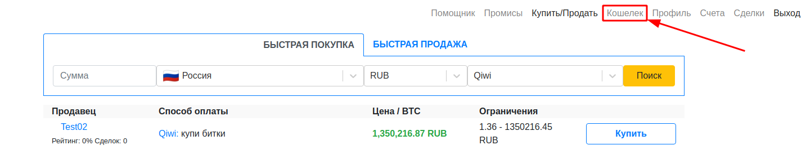
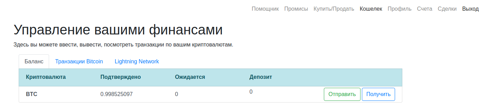

title: Управление вашими финансами: посмотреть, ввести, вывести криптовалюту
description: Правила пользования кошельком: как посмотреть транзакции, ввести и вывести криптовалюту в Transbithub.

#Как пользоваться кошельком

Кошелек позволяет вводить и выводить биткоины следующими способами:
- Транзакции Bitcoin
- Транзакции Lightning Network

Кошелек доступен только зарегистрированным пользователям.

Для перехода к кошельку зайдите в раздел "Кошелек":

После перехода, вы увидите примерно такое:

## Подтверждено
Сумма доступная к любому использованию. Вы можете распоряжаться ей, как считаете нужным.

## Ожидается
Сумма ожидаемая к поступлению на счет. Если вы вводите биткоины через сеть Bitcoin, то до получения
трех подтверждений, сумма транзакций отображается в этой колонке.

## Депозит
Когда вы совершаете сделку по покупке или продаже биткоинов, и вы являетесь той стороной, что отдает биткоины, происходит
депонирование. Т.е. биткоины вычитаются из колонки "Подтверждено" и резервируются в колонке "Депозит". Если сделка отменяется,
то биткоины возвращаются в колонку "Подтверждено". Если сделка завершается, то биткоины перечисляются новому владельцу.

## Транзакции Bitcoin
Список входящих и исходящих транзакций сети Bitcoin. Когда вы вводите или выводите биткоины через сеть Bitcoin,
информация о транзакциях отражается здесь.

## Lightning Network
Список BOLT11 приглашений к оплате, и список совершенных транзакций.

